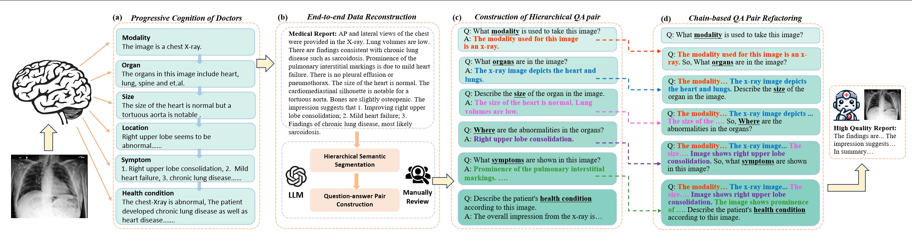

# [ICASSP 2025] CoMT: Chain-of-Medical-Thought Reduces Hallucination in Medical Report Generation

## Abstract
Automatic medical report generation (MRG), which possesses significant research value as it can aid radiologists in clinical diagnosis and report composition, has garnered increasing attention. Despite recent progress, generating accurate reports remains arduous due to the requirement for precise clinical comprehension and disease diagnosis inference. Furthermore, owing to the limited accessibility of medical data and the imbalanced distribution of diseases, the underrepresentation of rare diseases in training data makes large-scale medical visual language models prone to hallucinations, such as omissions or fabrications, severely undermining diagnostic performance and further intensifying the challenges for MRG in practice. In this study, to effectively mitigate hallucinations in medical report generation, we propose a chain-of-medical-thought approach (CoMT), which intends to imitate the cognitive process of human doctors by decomposing diagnostic procedures. The radiological features with different importance are structured into fine-grained medical thought chains to enhance the inferential ability during diagnosis, thereby alleviating hallucination problems and enhancing the diagnostic accuracy of MRG.

For further details, please refer to the  <a href="https://arxiv.org/abs/2406.11451"> Paper</a>.

## Datasets:
1. Links of medical datasets:

| Dataset Name | Link | Access |
|--------------|------|--------|
| MIMIC-CXR | https://physionet.org/content/mimic-cxr/2.0.0| Credentialed Access |
| OpenI |     https://www.kaggle.com/datasets/raddar/chest-xrays-indiana-university| 	Open Access |
| VQA-RAD | https://osf.io/89kps/| 	Open Access |
| SLAKE | https://www.med-vqa.com/slake/ | 	Open Access | 

2. The CoMT-format datasets proposed in this paper are stored in [/CoMT/dataset](https://github.com/TIMMY-CHAN/MILE/blob/main/Instruction_dataset/instruction_data.json). The images in the dataset should be downloaded from the provided link and stored at the corresponding path.

## Evaluation:
[medihall_score.py](https://github.com/TIMMY-CHAN/MILE/blob/main/eval_vqa.py) is used for caculate the Medihall Score. 

[word_metric.py](https://github.com/TIMMY-CHAN/MILE/blob/main/eval_vqa.py) is used for caculate the NLG Score. 

Modify some file paths based on your needs. 

## Citation
If you find this projct to be useful for your research, please consider citing.
<pre>
@inproceedings{jiang2024comt,
    title={CoMT: Chain-of-Medical-Thought Reduces Hallucination in Medical Report Generation}, 
    author={Yue Jiang and Jiawei Chen and Dingkang Yang and Mingcheng Li and Shunli Wang and Tong Wu and Ke Li and Lihua Zhang},
    booktitle={ICASSP},  
    year={2025}  
}
</pre>